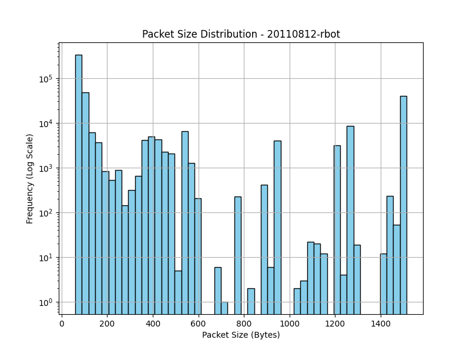
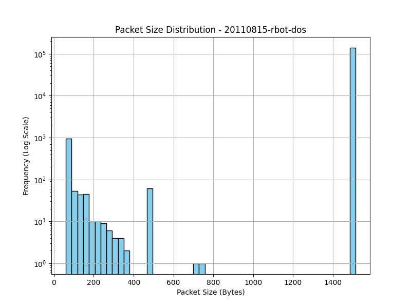
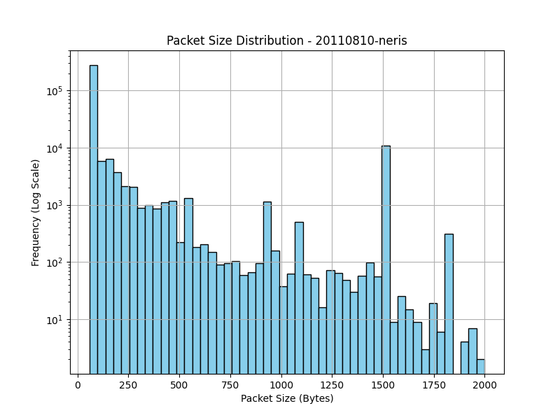
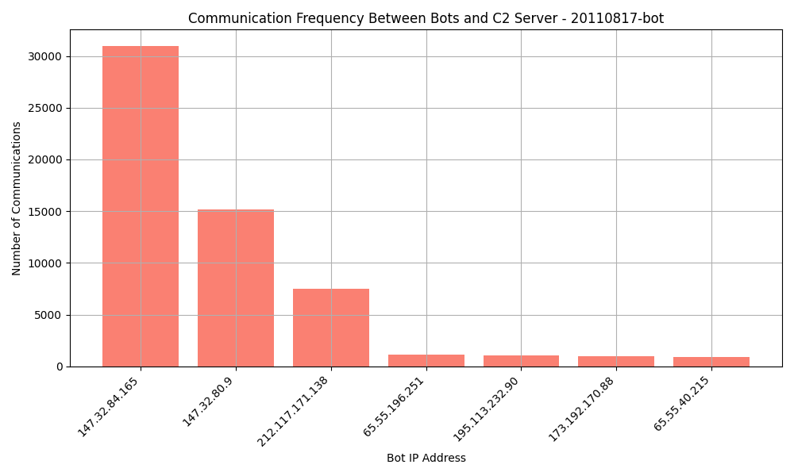
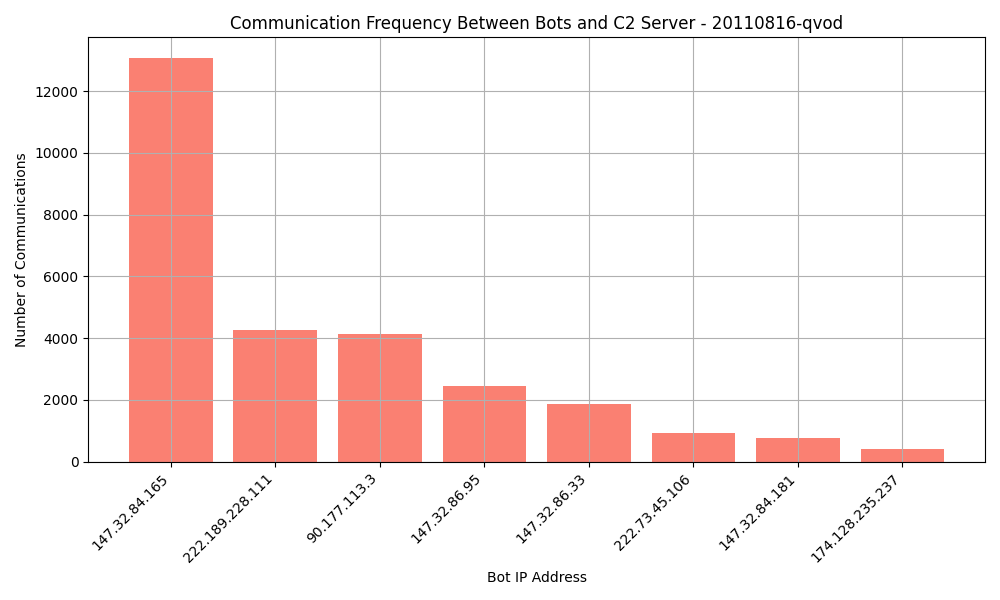
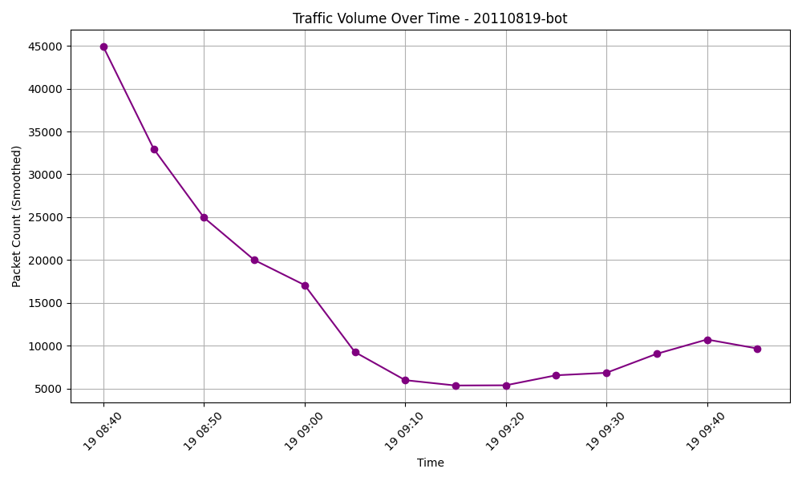
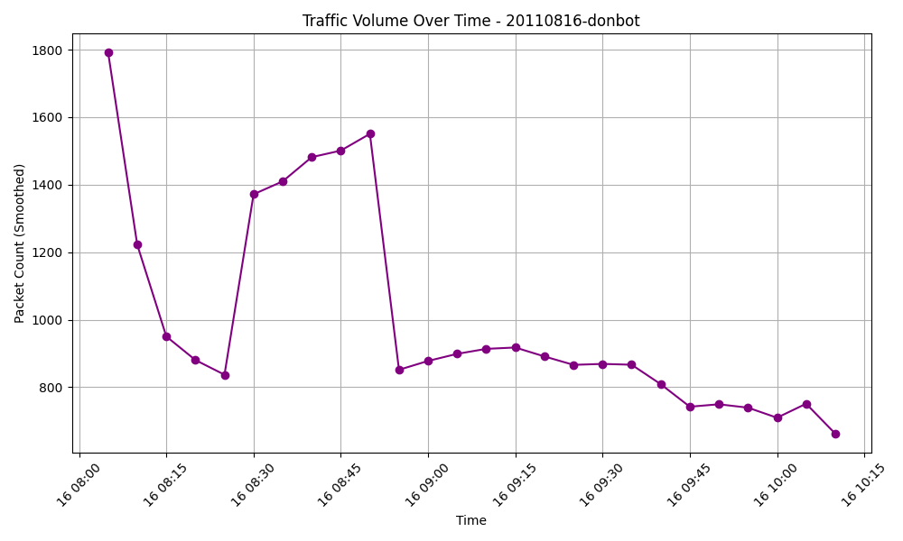

# Phase 2: Network Traffic Analysis

## Overview
Botnet traffic analysis is a critical aspect of cybersecurity, as botnets represent a significant threat to network infrastructure, enabling large-scale attacks such as Distributed Denial of Service (DDoS), spamming, data theft, and more. By understanding the traffic patterns associated with botnet behavior, security professionals can identify the unique characteristics of malicious network activities, allowing for the early detection and mitigation of botnet attacks. Analyzing botnet traffic not only helps in detecting active threats but also contributes to building more robust defense mechanisms against future attacks.

## Objectives
The primary goals of Phase 2 are to identify specific traffic features that are most indicative of botnet activity and to distinguish these from regular network traffic patterns. This involves carefully examining features such as packet size, protocol usage, time intervals, and communication frequencies to uncover patterns that reveal the presence of botnets. By focusing on these characteristics, we aim to develop an initial set of detection criteria that can improve the accuracy and efficiency of botnet detection techniques, laying the groundwork for more advanced detection strategies in future phases.

---

### Dataset-Specific Insights
| Dataset ID | Avg. Packet Size (bytes) | Unique Src IPs | Unique Dst IPs | C2 Comm. Count | Protocol Dist. (TCP/UDP) | Avg. Time Interval Between Packets (s) | Top 5 Communicating IPs | Peak Traffic Volume (packets/min) |
|------------|---------------------------|----------------|----------------|----------------|---------------------------|---------------------------------------|--------------------------|------------------------------------|
| 1          | 164.77                    | 2314          | 4198           | 321487         | {'tcp': 73.29, 'udp': 26.71} | 0.0532                               | ['147.32.84.165', '213.246.53.125', '184.154.132.106', '212.117.171.138', '147.32.80.9'] | 4245                               |
| 2          | 190.37                    | 320           | 1672           | 175491         | {'tcp': 98.64, 'udp': 1.36}  | 0.0699                               | ['147.32.84.165', '184.154.89.154', '173.236.31.226', '46.4.36.120', '212.117.171.138'] | 6642                               |
| 3          | 250.68                    | 4530          | 28812          | 476421         | {'tcp': 99.50, 'udp': 0.50}  | 0.5074                               | ['147.32.84.165', '178.77.71.27', '64.31.13.148', '38.229.70.20', '208.86.166.68']       | 5168                               |
| 4          | 1501.95                   | 9             | 13             | N/A            | {'udp': 99.41, 'tcp': 0.59}  | 0.0277                               | ['147.32.84.165', '85.190.0.3', '82.96.64.4', '147.32.80.9', '86.65.39.15']              | 7595                               |
| 5          | 659.94                    | 66            | 187            | N/A            | {'tcp': 99.48, 'udp': 0.52}  | 0.0265                               | ['147.32.84.165', '212.117.171.138', '209.85.148.147', '46.4.36.120', '65.55.40.23']    | 7788                               |
| 6          | 199.46                    | 10            | 1557           | 24387          | {'tcp': 99.40, 'udp': 0.60}  | 0.2959                               | ['147.32.84.165', '91.212.135.158', '90.177.113.3', '147.32.84.171', '147.32.96.45']    | 1791                               |
| 7          | 899.51                    | 14            | 17             | N/A            | {'tcp': 99.55, 'udp': 0.45}  | 0.0424                               | ['147.32.84.165', '218.29.42.137', '123.126.51.33', '61.135.188.210', '147.32.80.9']    | 9254                               |
| 8          | 243.34                    | 114           | 653            | N/A            | {'tcp': 84.61, 'udp': 15.39} | 0.8614                               | ['147.32.84.165', '222.189.228.111', '90.177.113.3', '147.32.86.95', '147.32.86.33']    | 1858                               |
| 9          | 335.22                    | 319           | 2551           | 159696         | {'tcp': 68.02, 'udp': 31.98} | 0.0618                               | ['147.32.84.165', '147.32.80.9', '212.117.171.138', '65.55.196.251', '195.113.232.90']  | 3143                               |
| 10         | 1269.36                   | 20            | 23             | 317428         | {'udp': 99.09, 'tcp': 0.91}  | 0.0547                               | ['147.32.84.165', '85.190.0.3', '78.40.125.4', '82.96.64.4', '147.32.84.171']           | 12012                              |
| 11         | 111.55                    | 7             | 9              | 414            | {'tcp': 78.99, 'udp': 21.01}  | 1.0145                               | ['147.32.84.165', '85.190.0.3', '38.229.70.20', '147.32.84.171', '147.32.84.79']        | 261                                |
| 12         | 804.77                    | 2184          | 2199           | 155411         | {'udp': 87.24, 'tcp': 12.76} | 0.0244                               | ['147.32.84.165', '58.215.240.7', '147.32.84.191', '123.124.139.240', '110.159.22.70']  | 26162                              |
| 13         | 245.42                    | 314           | 1714           | N/A            | {'tcp': 94.67, 'udp': 5.33}  | 0.1342                               | ['147.32.84.165', '184.173.217.40', '212.117.171.138', '147.32.80.9', '209.173.182.133'] | 6749                               |

### Dataset Summaries

- **Dataset 1**: High C2 communication frequency (321,487 interactions) and relatively short average time intervals between packets (0.0532 seconds) suggest highly active botnet behavior. The protocol distribution is predominantly TCP (73.29%), with some UDP, likely indicating a mix of C2 control messages and potential DDoS/spamming traffic.

- **Dataset 2**: High C2 communication frequency (175,491 interactions) with a strong TCP bias (98.64%). The average time interval between packets (0.0699 seconds) suggests frequent communications, indicating continuous botnet activity.

- **Dataset 3**: Large-scale botnet traffic with 476,421 C2 communications and a very high TCP proportion (99.50%), suggesting a centralized botnet model. The average time interval (0.5074 seconds) is longer, hinting at potentially coordinated, less frequent C2 communication.

- **Dataset 4**: Unusually large average packet sizes (1501.95 bytes) and a high UDP proportion (99.41%) suggest UDP flood attacks, potentially indicative of a DDoS pattern. The peak traffic volume is also elevated, pointing to high-volume, disruptive activities.

- **Dataset 5**: This dataset shows a strong TCP preference (99.48%) and smaller average packet sizes (659.94 bytes). The short average time interval (0.0265 seconds) indicates frequent communication, which could be part of regular C2 messages or data transfer between botnet nodes.

- **Dataset 6**: Moderate C2 communication count (24,387) with a very high TCP share (99.40%). The longer average time interval (0.2959 seconds) may indicate a slower communication rate, possibly due to periodic bot commands or status checks.

- **Dataset 7**: Predominantly TCP-based communication (99.55%) with a high average packet size (899.51 bytes). This dataset's peak traffic volume (9254 packets/min) and short intervals (0.0424 seconds) suggest high-frequency botnet activity with potential data exfiltration or command-response cycles.

- **Dataset 8**: A mixed protocol distribution (84.61% TCP, 15.39% UDP) and relatively high time intervals (0.8614 seconds) suggest sporadic botnet activity. The peak traffic volume (1858 packets/min) is relatively low, which might indicate less aggressive activity, such as reconnaissance.

- **Dataset 9**: Moderate C2 communication count (159,696) and a higher-than-average UDP proportion (31.98%), which could point to DDoS or spamming activities. The short average time interval (0.0618 seconds) supports this, showing rapid packet exchanges.

- **Dataset 10**: High peak traffic volume (12012 packets/min) with nearly all communication over UDP (99.09%), suggesting aggressive DDoS traffic or spamming behavior. The short time interval (0.0547 seconds) further indicates intense activity.

- **Dataset 11**: Lower communication volume (414 C2 interactions) with a moderate UDP usage (21.01%). The longer average time interval (1.0145 seconds) suggests a slower communication rate, which could be a result of scheduled updates or intermittent botnet control commands.

- **Dataset 12**: High UDP usage (87.24%) and an extremely high peak traffic volume (26,162 packets/min) indicate non-traditional botnet activity, likely DDoS-related, with significant high-volume attack periods. The short average time interval (0.0244 seconds) suggests aggressive packet transmission.

- **Dataset 13**: Predominantly TCP-based communication (94.67%) with moderate UDP use (5.33%). The higher average time interval (0.1342 seconds) suggests intermittent communication, with a mix of control messages and potential low-level data exchange. The peak traffic volume (6749 packets/min) indicates periods of intensified activity.

---

#### Visualization Interpretations

For each dataset, we generated three key visualizations:

1. **Packet Size Distribution**
   - **Purpose**: This graph shows the distribution of packet sizes within each dataset, highlighting common packet sizes and any notable outliers.
   - **Interpretation**: Datasets with a high concentration of small packets (e.g., Dataset 3) are likely indicative of regular C2 communications, where small packets are typically used to send commands. Datasets with larger packet sizes (e.g., Dataset 4) may suggest data exfiltration or high-volume DDoS traffic.
   - **Example Analysis**: In Dataset 1, most packets are small, suggesting regular botnet command exchanges. In contrast, Dataset 4 shows larger packets, indicative of bulk data transfer, which could align with DDoS or data exfiltration activities.
   
   - **Visualizations**:
     - Dataset 3 Packet Size Distribution:  
       
     - Dataset 4 Packet Size Distribution:  
       
     - Dataset 1 Packet Size Distribution:  
       

2. **Communication Frequency**
   - **Purpose**: This graph displays the frequency of communication between bot IPs and the C2 server, identifying which IPs communicate most often with the C2.
   - **Interpretation**: Centralized botnets often have a few IPs communicating frequently with the C2 server. For example, Dataset 9 shows high communication frequency from specific IPs to the C2, suggesting a centralized structure. Conversely, datasets with more dispersed communication could indicate a decentralized or peer-to-peer botnet model.
   - **Example Analysis**: Dataset 9’s communication frequency graph reveals a centralized communication pattern, with high interactions between specific IPs and the C2 server. In Dataset 8, the pattern is more dispersed, which may indicate a decentralized botnet.
   
   - **Visualizations**:
     - Dataset 9 Communication Frequency:  
       
     - Dataset 8 Communication Frequency:  
       

3. **Traffic Volume Over Time**
   - **Purpose**: This visualization shows traffic volume (packets) over time, highlighting periods of high botnet activity.
   - **Interpretation**: Spikes in traffic volume can indicate potential botnet activities, such as DDoS attacks or spam bursts. Datasets with sustained high traffic (e.g., Dataset 12) are particularly noteworthy and could be indicative of sustained attacks.
   - **Example Analysis**: Dataset 12’s traffic volume graph shows consistent, high-volume traffic spikes, which could point to DDoS attacks. In Dataset 6, the traffic is steadier, indicating ongoing but less intense botnet communication.
   
   - **Visualizations**:
     - Dataset 12 Traffic Volume Over Time:  
       
     - Dataset 6 Traffic Volume Over Time:  
       

---

### Analysis of Feature Extraction Results

This section provides a summary of insights gained from each feature extracted in Phase 2. These insights help us understand how different botnets operate and how they might be detected.

#### Feature Analysis

- **Packet Sizes**: Most datasets showed packet sizes clustered around a central range, likely corresponding to typical command messages. However, Datasets 4 and 10 showed larger average packet sizes, suggesting potential data-heavy activities, such as DDoS attacks or large data exfiltration.
- **Time Intervals**: Time interval analysis revealed that Datasets 1, 3, and 9 had very short, consistent intervals, indicative of automated, frequent communication typical in botnets. In contrast, Dataset 8 had longer intervals, suggesting more sporadic botnet communication.
- **Communication Patterns**: The analysis of source and destination IPs showed that Datasets 1, 2, and 3 had highly centralized communication, with a few IPs communicating frequently with the C2 server. This pattern is often indicative of a centralized botnet structure. In contrast, Datasets 8 and 13 had more decentralized communication, possibly indicating a peer-to-peer botnet structure.

#### Detailed Dataset Analysis

| Dataset ID | Average Packet Size (bytes) | Max Packet Size (bytes) | Min Packet Size (bytes) | Top 5 Communicating IPs | C2 Communication Count | Peak Traffic Volume (packets/min) |
|------------|-----------------------------|--------------------------|--------------------------|--------------------------|-------------------------|-----------------------------------|
| 1          | 164.77                      | 10274                    | 60                       | ['147.32.84.165', '95.211.130.26', '111.221.102.89', '95.59.26.3', '95.59.26.2'] | 4197                    | 60                                |
| 2          | 190.37                      | 11734                    | 60                       | ['147.32.84.165', '87.248.203.254', '88.154.52.66', '88.250.200.14', '89.103.213.96'] | 1671                    | 60                                |
| 3          | 250.68                      | 5894                     | 60                       | ['147.32.84.165', '111.221.96.244', '111.89.136.100', '111.89.136.101', '111.89.136.102'] | 28811                   | 60                                |
| 4          | 1501.95                     | 4434                     | 60                       | ['147.32.84.165', '147.32.80.9', '147.32.84.171', '147.32.84.79', '147.32.96.45'] | 12                      | 60                                |
| 5          | 659.94                      | 9467                     | 60                       | ['147.32.84.165', '109.200.239.148', '117.204.76.152', '120.63.27.163', '147.32.80.9'] | 186                     | 60                                |
| 6          | 199.46                      | 4434                     | 60                       | ['147.32.84.165', '147.32.80.9', '147.32.84.171', '147.32.84.79', '147.32.96.45'] | 1556                    | 48                                |
| 7          | 899.51                      | 8742                     | 60                       | ['147.32.84.165', '123.126.51.33', '123.126.51.57', '123.126.51.64', '123.126.51.65'] | 16                      | 60                                |
| 8          | 243.34                      | 7354                     | 60                       | ['147.32.84.165', '112.90.138.160', '112.90.86.182', '112.90.86.183', '112.90.86.184'] | 652                     | 60                                |
| 9          | 335.22                      | 14654                    | 60                       | ['147.32.84.165', '117.199.122.247', '117.207.11.6', '117.213.61.195', '119.154.71.9'] | 2550                    | 60                                |
| 10         | 1269.36                     | 4434                     | 60                       | ['147.32.84.165', '140.211.167.98', '147.32.80.9', '147.32.84.171', '147.32.84.79'] | 22                      | 60                                |
| 11         | 111.55                      | 2924                     | 60                       | ['147.32.84.165', '147.32.80.9', '147.32.84.171', '147.32.84.79', '38.229.70.20'] | 8                       | 10                                |
| 12         | 804.77                      | 10274                    | 60                       | ['147.32.84.165', '1.36.164.194', '1.60.84.83', '98.119.74.240', '109.154.219.202'] | 2198                    | 60                                |
| 13         | 245.42                      | 13194                    | 60                       | ['147.32.84.165', '101.0.32.121', '109.200.239.148', '109.86.117.4', '109.86.241.24'] | 1713                    | 60                                |

---

### Key Findings

From the detailed analysis across 13 datasets, several patterns emerged, which are crucial for refining botnet detection approaches:

1. **High UDP Traffic for Attack Patterns**: Datasets 4, 10, and 12 exhibited elevated UDP traffic volumes, commonly linked to DDoS or spamming activities. These datasets showed clear spikes in traffic, often coinciding with peak packet volumes, suggesting large-scale attack behaviors.

2. **Centralized C2 Communication Structure**: Datasets 1, 2, and 9 showed frequent interactions with specific C2 IP addresses, hinting at a centralized botnet architecture. This frequent communication with a single C2 IP is indicative of a control structure typical of traditional botnets.

3. **Prevalence of Small, Consistent Packet Sizes**: A notable number of datasets, especially Datasets 1 and 3, revealed a predominance of small, consistent packet sizes. This pattern aligns with botnet command messaging, where low-bandwidth packets are preferred for continuous C2 communication without drawing excessive network attention.

These findings provide a foundational understanding for further botnet detection developments, emphasizing the role of UDP traffic spikes, centralized C2 patterns, and consistent small packet sizes as indicators of botnet activity.

---