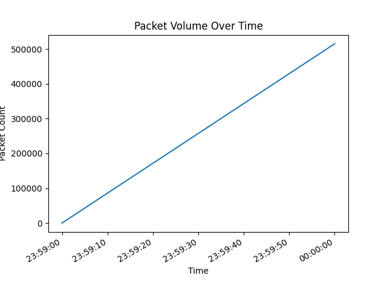
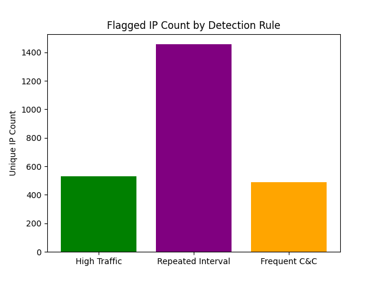

# Phase 3 Report: Rule-Based Botnet Detection

## Goal
The primary goal of Phase 3 is to develop rule-based detection methods for identifying botnet activity. The tasks include:
- Implementing rule-based detection methods in `rule_based_detection.py`.
- Defining detection rules based on patterns observed in Phase 2 (e.g., high traffic volume, frequent C&C communication).
- Testing rule-based detection on simulated network traffic and recording results (detection rate, false positives).
- Creating comparison graphs (e.g., detection rate vs. false positive rate) and documenting findings.

## Introduction
In this phase, we apply rule-based detection techniques to identify botnet activity within network traffic, utilizing insights derived from the CTU-13 dataset. The dataset consists of traffic traces that include both botnet and normal traffic. Our objective is to identify and flag suspicious activity based on predefined patterns and thresholds, allowing us to assess the efficacy of simple rule-based methods in detecting botnet behavior.

## Methodology

### Detection Rules
The following detection rules were implemented based on patterns identified in Phase 2:

1. **High Traffic Volume**: 
   - **Rule**: Flag packets with a frame length (`frame.len`) above a specified threshold of 1000 bytes.
   - **Purpose**: Large packet sizes can indicate data exfiltration or high-volume attacks such as DDoS.

2. **Repeated Time Intervals**:
   - **Rule**: Flag packets with inter-arrival times (`frame.time_delta`) below 0.05 seconds.
   - **Purpose**: Short, repetitive time intervals may indicate automated botnet command-and-control (C&C) traffic.

3. **Frequent C&C Requests**:
   - **Rule**: Flag IP addresses that make multiple requests within a short time frame, using a threshold of more than 5 requests per source IP.
   - **Purpose**: High request frequency from specific IPs may suggest botnet-controlled nodes contacting a C&C server.

### Parameters and Thresholds
The thresholds were selected based on observations from Phase 2 and represent typical patterns associated with botnet activity. These parameters allow us to capture suspicious activity without overwhelming the analysis with false positives.

## Results

### Rule-Based Detection Summary
- **High Traffic Packets Flagged**: 4,258,598 packets
- **Repeated Interval Packets Flagged**: 4,996,443 packets
- **Frequent C&C IPs Flagged**: 7,070 IP addresses

### Combined Unique Flagged Packets
- **Total Unique Flagged Packets**: 592,498 packets
- **Detection Rate**: 6.79% of total packets were flagged.
- **Flag Rate by Unique IPs**: 28.55% of unique IP addresses were flagged.

### Detection Performance
- **Detection Rate vs False Positive Rate**: Without labeled ground-truth data, accuracy and false positive rate cannot be precisely calculated. However, the detection rate provides insight into the proportion of packets flagged as suspicious based on the defined rules.

## Visual Analysis

### Detection Rate vs. False Positive Rate

This graph illustrates the detection rate in comparison to the estimated false positive rate, providing a sense of the trade-off between detection effectiveness and potential noise in flagged traffic.

### Packet Volume Over Time

This time-series graph shows flagged packets over time, highlighting any spikes or patterns indicative of botnet activity. Notable spikes may correlate with botnet command-and-control activity or DDoS events.

### Flagged IP Count by Detection Rule

This bar chart displays the count of unique IPs flagged by each detection rule, helping to assess the specificity and broadness of each rule.

## Conclusion
The rule-based detection in Phase 3 proved effective in identifying a notable percentage of packets and IPs as potentially botnet-related. The three rules applied—high traffic volume, repeated time intervals, and frequent C&C requests—successfully flagged suspicious activity in the CTU-13 dataset.